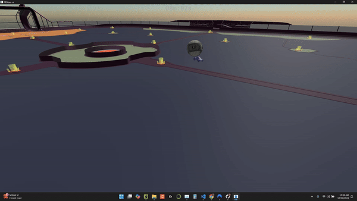

# Rocket League Dribble Bot
This repository showcases my Rocket League bot, trained with the goal of continuously dribbling the ball atop its car. This README documents the key features that were involved in successfully training a dribbling bot.

## Requirements
* rlgym-sim
* rlviser
* rlgym-PPO
##

### rlviser visualization


## Core infastructure
This project is able to exist because of the RLbot framework and the work done by the RLgym community. 

RLBot has direct integration with Rocket League itself, allowing game data to be collected directly from Rocket League in a designated offline-only bot mode. RLBot collects values like positions, velocities, etc. for cars and the ball within the game, and allows programmatic bots to play.

The RLGym community made several useful implementations that play various roles in training reinforcement learning models for use with RLBot. This project relies on their work to

* Simulate Rocket League games at increased speed
* Use as backbone for lots of functionality (observations, actions, states, rewards)
* Implement the PPO training algorithm

Thanks to the dedicated community members that made these implementations to allow such cool projects and learning experiences to be had.


## Simulation details  (```mysim.py```)
### State and termination
The state setter sets the ball atop the car in a random location, each with their own slightly randomized velocity. The bot can attempt to dribble until the ball hits the ground, and the episode is terminated and reset to a new one.

The randomized starting condition is meant to help learn a diverse policy and avoid determinism.

### Actions and Observations
The action space consists of several available movements, such as turning (continuous value), accelerating, boosting, and drifting. For simplicity, jumping has been removed from the action space as it's not needed for dribbling.


With some meticulous experimenting, I found the following observation space to work well:
1. Relative ball position rotated -- Car to ball vector, rotated based on the orientation of the car
2. Relative ball velocity rotated -- Difference between ball velocity and car velocity, rotated depending on orientation of car
3. Ball touches -- A list of 3 binary flags indicating whether the agent has touched the ball, for the last 3 time steps
4. Rotated ball acceleration -- The ball's acceleration vector, rotated according to the car's orientation
5. Car speed
6. Distance to wall -- Distance to the closest wall in car's forward direction 
7. Wall bump feature -- is 1 or -1 depending on the orientation of the closest wall in the car's forward direction. 
* This is meant to indicate whether the agent should turn left, or right to avoid bumping into the nearest forward wall


### Rewards
1. Dribble reward
* Rewards closer x and y distance to the ball, encouraging balancing towards the center of the car. This decreases nonlinearly with distance from car.
* Also penalizes with a negative value scaling with car distance to ball, whenever the episode ends.
2. Velocity with ball
* Rewards similar car and ball velocity vectors, encouraging smooth dribbling movement
3. Ball velocity
* Rewards based on magnitude of ball velocity
4. Consecutive touches
* Rewards based on amount of recent touches capped at 8
* Encourages prolonged contact with the ball, to avoid bouncing and increase control
5. Player to ball velocity (imported from RLGym)
* Rewards based on agent's velocity toward ball, enouraging it to follow the ball which aids in dribbling.

Each reward is assigned a weight based on how frequently it occurs, and its relative importance


## Metrics
During training, the console outputs a link to visualize lots of training metrics using wandb